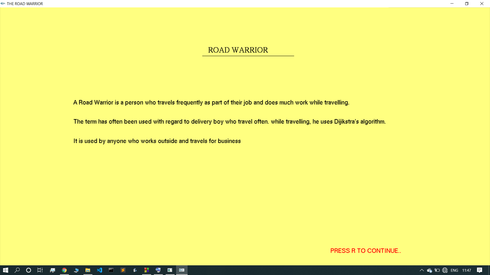

<h2>Travelling-SalesMan🏃‍♂️</h2>
 
<h4>About the project:</h4> 
<ul><li>The project is based on the Dijikstra's algorithm to find single source shortest path.</li>
  <li>Dijikstra's original algorithm found the
    shortest path between two nodes.</li><li> For a given source node in the graph, the algorithm finds the shortest path between the node and every other.</li> <li>It can also be used for finding the shortest paths from a single node to a single destination node by stopping the algorithm once the shortest path to the destination node has been determined.</li>
  <li>In this project, the nodes of the graph represent houses of the customers🏠🏡</li>
  <li>Edge path costs represent travelling distances for the delivery boy to travel between pairs of houses connected by a direct road🛣  </li></ul>
  <h4>Advantages:</h4>
  <ul><li>Dijikstra's algorithm is used to find the shortest path from one houses to all other customers.</li>
  <li>This enables delivery boy to saves his time and energy🕐</li></ul>
     
 <h3>Screenshots</h3>
    <h4>Introduction Window</h4>
    

     
    <h4>Order Window</h4>
    

     
    <h4>Person Travelling</h4>
    

     
    <h4>Finish Window</h4>
    

  
